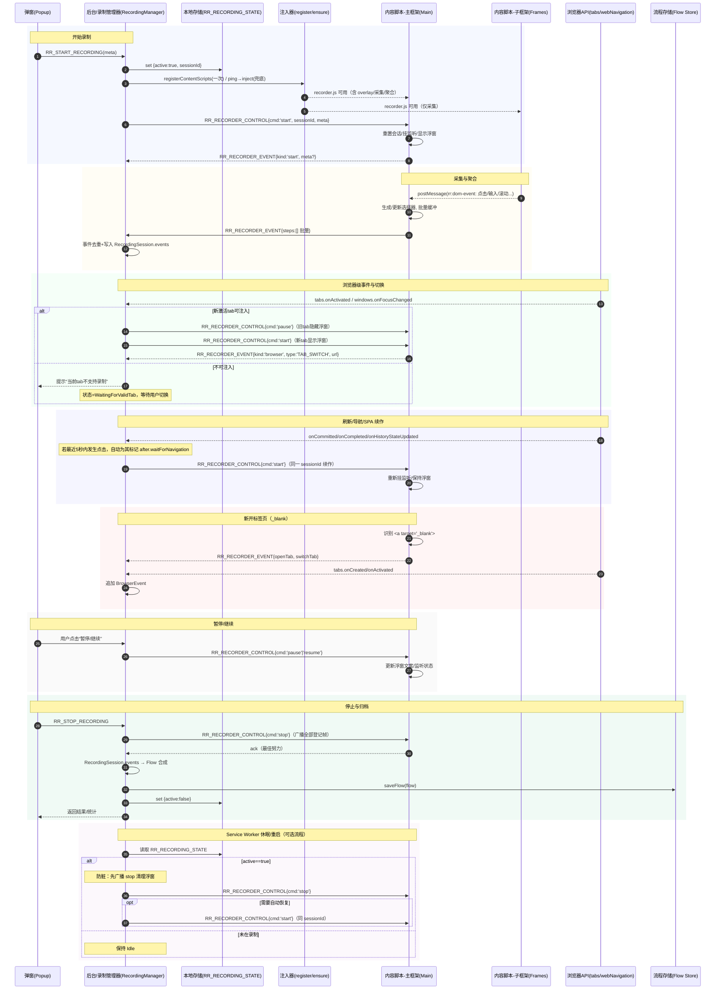

# 录制系统数据/状态流（Mermaid）

本文件提供录制端到端数据流与完整时序图。消息名与代码一致：

- 后台入口：`RR_START_RECORDING` / `RR_STOP_RECORDING`
- 控制下发：`RR_RECORDER_CONTROL`（`cmd: 'start'|'stop'|'pause'|'resume'`）
- 事件上报：`RR_RECORDER_EVENT`
- 探活：`rr_recorder_ping`

## 数据流（全局）

```mermaid
flowchart TD
  %% 参与者
  P[弹窗 Popup]
  B[[后台 Service Worker\n录制管理器 RecordingManager]]
  S[(本地存储\nRR_RECORDING_STATE)]
  INJ[[注入器\nregisterContentScripts / ensureRecorderInjected]]
  FS[(流程存储 Flow Store\nsaveFlow/listFlows)]

  subgraph TAB[当前活动标签页]
    direction TB
    subgraph CMain[内容脚本（主框架 Main Frame）]
      AGG[聚合器 Aggregator\n收集/批量上报 RR_RECORDER_EVENT\n渲染录制浮窗]
    end
    subgraph CChild[内容脚本（子框架 Frames）]
      COL[事件采集 Collectors\n点击/输入/滚动/键盘...]
    end
  end

  API[[浏览器 API\ntabs/webNavigation/windows]]

  %% 启动
  P -- RR_START_RECORDING(meta) --> B
  B -- 写入 {active:true, sessionId} --> S
  B -- 一次性注册/兜底注入 --> INJ
  B -- ping(rr_recorder_ping)/注入 --> INJ
  INJ -- executeScript(recorder.js) --> TAB

  %% 控制
  B -- RR_RECORDER_CONTROL{cmd:'start', sessionId} --> AGG
  B -- RR_RECORDER_CONTROL{cmd:'pause'|'resume'} --> AGG
  B -- RR_RECORDER_CONTROL{cmd:'stop'} --> AGG

  %% 子框架 → 主框架
  COL -- window.top.postMessage(rr:dom-event) --> AGG

  %% 主框架 → 后台
  AGG -- RR_RECORDER_EVENT(批量步骤) --> B

  %% 浏览器级事件
  API -- 新建/切换/关闭/导航/SPA --> B
  B -- 归并为 BrowserEvent --> B

  %% 会话缓冲（单一数据源）
  B -. 追加事件 .-> B
  B:::note -. RecordingSession.events .- B

  %% 停止
  P -- RR_STOP_RECORDING --> B
  B -- RR_RECORDER_CONTROL{cmd:'stop'} --> AGG
  B -- events → Flow 合成 --> FS
  B -- 写入 {active:false} --> S

  classDef note fill:#f6f8fa,stroke:#c9d1d9,color:#333;
```

备注

- 优先使用 `registerContentScripts(allFrames, matchAboutBlank, document_start)` 常驻注入，`ensureRecorderInjected` 兜底。
- 仅主框架渲染录制浮窗；子框架只采集事件并通过 `postMessage` 上报主框架。
- 后台为唯一权威数据源：统一写入 `RecordingSession.events`。
- 停止时合成 Flow 保存，并清理 `RR_RECORDING_STATE`。

## 录制时序（完整）



提示

- 探活优先：`rr_recorder_ping` 成功则复用现有脚本，仅切换监听态；失败再注入。
- 不可注入页面：启动失败不记录起始 URL，只提示并等待可注入页面建立起点。
- 自动导航标注：后台在最近点击后短时内捕获导航，自动为该点击标记 `after.waitForNavigation = true`。
