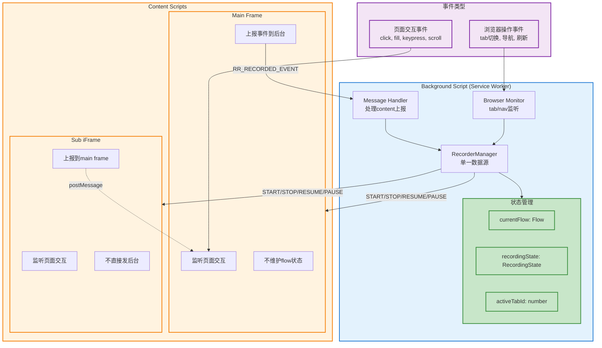
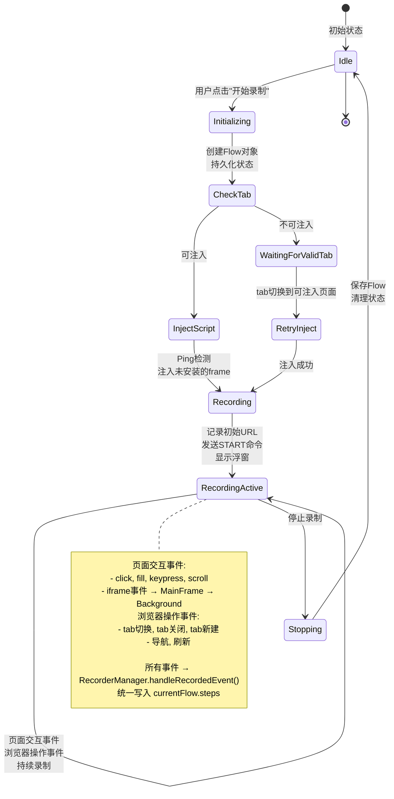
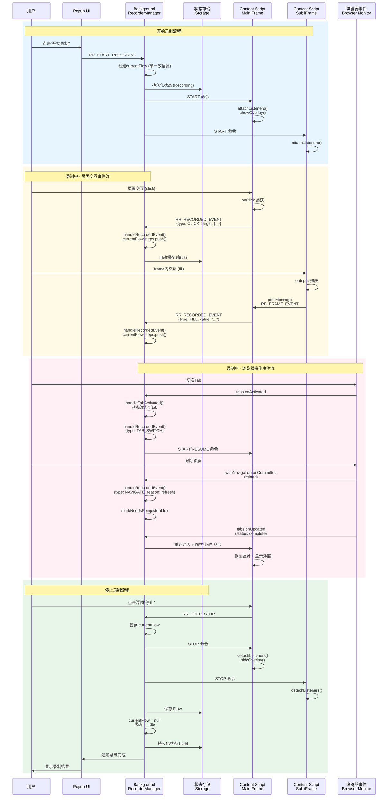
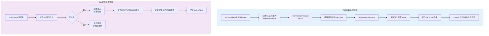
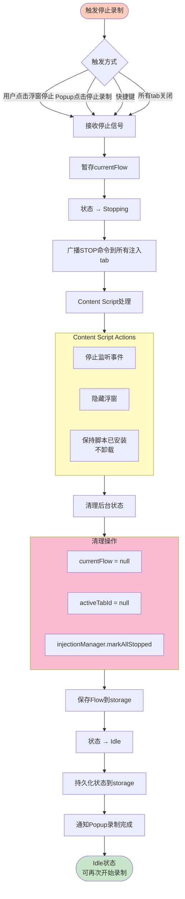

```mermaid
flowchart TB
    subgraph SW["Service Worker 休眠恢复"]
        SW1[Background唤醒] --> SW2[init从storage恢复状态]
        SW2 --> SW3{是Recording?}
        SW3 -->|是| SW4[恢复currentFlow<br/>中间保存]
        SW3 -->|否| SW9[正常启动]
        SW4 --> SW5[重新附加监听器]
        SW5 --> SW6[向所有tab广播RESUME]
        SW6 --> SW7[继续录制]
    end

    subgraph TC["Tab关闭处理"]
        TC1[Tab关闭事件] --> TC2[记录TAB_CLOSE事件]
        TC2 --> TC3[清理注入状态]
        TC3 --> TC4{是activeTab?}
        TC4 -->|是| TC5{还有其他tab?}
        TC4 -->|否| TC9[继续监听]
        TC5 -->|是| TC6[切换到其他tab]
        TC5 -->|否| TC7[停止录制]
    end


    subgraph SP["特殊页面处理"]
        SP1[尝试注入] --> SP2{可注入?}
        SP2 -->|否| SP3[注入失败<br/>chrome://, edge://等]
        SP2 -->|是| SP9[正常注入]
        SP3 --> SP4[显示提示<br/>当前页面不支持录制]
        SP4 --> SP5[继续监听tab切换]
        SP5 --> SP6[不中断整体录制]
    end

    style SW fill:#e1f5fe
    style TC fill:#fff3e0
    style EU fill:#fce4ec
    style SP fill:#f1f8e9
```

# 录制功能重构方案

## 目录

- [一、核心问题分析](#一核心问题分析)
- [二、重构架构设计](#二重构架构设计)
- [三、核心模块详细设计](#三核心模块详细设计)
- [四、详细场景分析与解决方案](#四详细场景分析与解决方案)
- [五、完整状态流转图](#五完整状态流转图)
- [六、核心设计原则总结](#六核心设计原则总结)

---

## 一、核心问题分析

当前代码存在的主要问题：

### 1. 职责混乱

`index.ts` 包含录制、回放、调度、触发器等所有功能（950行），难以维护

### 2. 数据源混乱

后台脚本和内容脚本各自维护状态，双向同步容易出错：

- 后台：`currentRecording.flow`
- 内容脚本：`pendingFlow`
- 停止时需要合并数据，容易丢失或重复

### 3. iframe通信不清晰

虽然注入到所有frame，但子frame事件没有统一上报到mainFrame

### 4. 状态管理分散

`recordingActive`、`allowedByPersistentState`、`isRecording`、`isPaused` 分散各处

---

## 二、重构架构设计

### 2.1 模块拆分

```
record-replay/
├── recording/                    # 录制模块（新建）
│   ├── recorder-manager.ts      # 后台录制管理器（单一数据源）
│   ├── recorder-state.ts        # 录制状态管理
│   ├── recorder-events.ts       # 录制事件类型定义
│   ├── browser-events-monitor.ts # 浏览器级别事件监听（tab切换/导航等）
│   └── content-injection.ts     # 内容脚本注入管理
├── replay/                       # 回放模块（保持现有）
│   ├── flow-runner.ts           # 现有的 flow-runner
│   └── runner.ts                # 现有的 runner
├── flows/                        # Flow数据管理
│   ├── flow-store.ts            # 现有的 flow-store
│   └── types.ts                 # Flow类型定义
├── triggers/                     # 触发器模块
│   └── trigger-store.ts
├── schedules/                    # 调度模块
│   └── schedule-store.ts
└── index.ts                      # 总入口（精简，只做路由）
```

### 2.2 数据流设计（关键：单一数据源）

**原则：后台脚本是唯一的数据源和状态管理中心**

#### 文本版本

```
┌─────────────────────────────────────────────────────────┐
│                   Background Script                      │
│  ┌───────────────────────────────────────────────────┐  │
│  │         RecorderManager (单一数据源)               │  │
│  │  - currentFlow: Flow                              │  │
│  │  - recordingState: RecordingState                 │  │
│  │  - activeTabId: number                            │  │
│  └───────────────────────────────────────────────────┘  │
│           ▲                           ▲                  │
│           │ 页面事件上报               │ 浏览器事件        │
│           │                           │                  │
│  ┌────────┴────────┐         ┌───────┴──────────┐      │
│  │ Message Handler │         │ Browser Monitor   │      │
│  │  处理content上报  │         │ tab/nav监听       │      │
│  └─────────────────┘         └──────────────────┘      │
└─────────────────────────────────────────────────────────┘
           │
           │ 控制指令 (start/stop/pause)
           ▼
┌─────────────────────────────────────────────────────────┐
│                    Content Scripts                       │
│  ┌──────────────────────┐    ┌──────────────────────┐  │
│  │  Main Frame          │    │  Sub iFrame          │  │
│  │  - 监听页面交互       │◄───┤  - 监听页面交互       │  │
│  │  - 不维护flow状态    │    │  - 上报到main frame  │  │
│  │  - 只负责上报事件    │    │  - 不直接发后台      │  │
│  └──────────────────────┘    └──────────────────────┘  │
└─────────────────────────────────────────────────────────┘
```

#### Mermaid 架构图



**关键改变：**

- ❌ 内容脚本**不再**维护 `pendingFlow`
- ✅ 内容脚本只负责**监听事件 → 立即上报 → 清空**
- ✅ 后台脚本 `RecorderManager` 是**唯一**累积和管理 steps 的地方
- ✅ 子iframe事件先上报到main frame，再由main frame统一发后台

---

## 三、核心模块详细设计

### 3.1 RecorderManager (后台 - 单一数据源)

```typescript
// recording/recorder-manager.ts

class RecorderManager {
  private currentFlow: Flow | null = null;
  private state: RecordingState = RecordingState.Idle;
  private activeTabId: number | null = null;

  // 开始录制
  async startRecording(meta?: Partial<Flow>): Promise<Result> {
    // 1. 防重检查
    if (this.state !== RecordingState.Idle) {
      return { success: false, error: 'Already recording' };
    }

    // 2. 初始化flow（唯一数据源）
    this.currentFlow = {
      id: meta?.id || `flow_${Date.now()}`,
      name: meta?.name || '未命名录制',
      steps: [],
      variables: [],
      ...
    };

    // 3. 更新状态
    this.state = RecordingState.Recording;
    await this.persistState();

    // 4. 注入脚本
    const tab = await getActiveTab();
    this.activeTabId = tab.id;
    await ContentInjection.inject(tab.id);

    // 5. 通知content script开始（只需要开始监听，不传flow）
    await this.sendCommand(tab.id, 'START');

    return { success: true };
  }

  // 处理上报的事件（唯一的数据写入点）
  handleRecordedEvent(event: RecordedEvent): void {
    if (this.state !== RecordingState.Recording || !this.currentFlow) {
      return; // 忽略无效事件
    }

    // 所有步骤统一在这里累积
    const step = this.convertEventToStep(event);
    this.currentFlow.steps.push(step);
    this.currentFlow.meta.updatedAt = new Date().toISOString();
  }

  // 停止录制
  async stopRecording(): Promise<Result> {
    if (this.state === RecordingState.Idle) {
      return { success: false, error: 'Not recording' };
    }

    // 1. 暂存flow
    const flow = this.currentFlow;

    // 2. 清空状态
    this.currentFlow = null;
    this.state = RecordingState.Idle;
    await this.persistState();

    // 3. 通知所有content script停止
    await this.broadcastCommand('STOP');

    // 4. 保存flow
    if (flow) {
      await saveFlow(flow);
    }

    return { success: true, flow };
  }
}
```

### 3.2 Content Script (极简化)

```javascript
// inject-scripts/recorder.js（重构思路示例，伪代码）
(function () {
  let isActive = false; // 是否挂载监听

  // 子 iframe → 主框架
  function postToTop(kind, detail) {
    try {
      window.top.postMessage({ type: 'rr:dom-event', payload: { kind, detail } }, '*');
    } catch {}
  }

  // 交互采集（仅采集，不做 step 写入）
  function onClick(e) {
    if (!isActive) return;
    const target = buildTarget(e.target);
    const detail = { type: 'click', target, ts: Date.now() };
    if (window !== window.top) postToTop('dom', detail);
    else
      chrome.runtime.sendMessage({
        type: 'rr_recorder_event',
        payload: { kind: 'steps', steps: [detail] },
      });
  }

  // 主框架聚合子帧事件
  if (window === window.top) {
    window.addEventListener('message', (ev) => {
      const data = ev?.data;
      if (!data || data.type !== 'rr:dom-event') return;
      const detail = data.payload?.detail;
      if (!detail) return;
      chrome.runtime.sendMessage({
        type: 'rr_recorder_event',
        payload: { kind: 'steps', steps: [detail] },
      });
    });
  }

  // 控制命令：使用 action + cmd，与现有实现一致
  chrome.runtime.onMessage.addListener((request) => {
    if (request && request.action === 'rr_recorder_control') {
      const cmd = request.cmd;
      if (cmd === 'start') {
        isActive = true;
        attachListeners();
        showOverlay();
        return true;
      }
      if (cmd === 'pause') {
        isActive = false; // 不销毁 overlay，仅更新状态
        updateOverlay('paused');
        return true;
      }
      if (cmd === 'resume') {
        isActive = true;
        updateOverlay('recording');
        return true;
      }
      if (cmd === 'stop') {
        isActive = false;
        detachListeners();
        removeOverlay();
        return true;
      }
    }
    return false;
  });
})();
```

### 3.3 Browser Events Monitor (后台)

```typescript
// recording/browser-events-monitor.ts

class BrowserEventsMonitor {
  constructor(private manager: RecorderManager) {}

  init() {
    // 监听tab切换
    chrome.tabs.onActivated.addListener((info) => {
      if (!this.manager.isRecording()) return;

      const event: RecordedEvent = {
        type: 'TAB_SWITCH',
        tabId: info.tabId,
        timestamp: Date.now(),
      };

      this.manager.handleRecordedEvent(event);
    });

    // 监听导航
    chrome.webNavigation.onCommitted.addListener((details) => {
      if (!this.manager.isRecording()) return;
      if (details.frameId !== 0) return; // 只记录顶级导航

      const event: RecordedEvent = {
        type: 'NAVIGATE',
        url: details.url,
        transitionType: details.transitionType,
        timestamp: Date.now(),
      };

      this.manager.handleRecordedEvent(event);
    });

    // ... 其他浏览器级别事件
  }
}
```

### 3.4 状态管理

```typescript
// recording/recorder-state.ts

enum RecordingState {
  Idle = 'idle', // 未录制
  Recording = 'recording', // 录制中
  Paused = 'paused', // 已暂停
  WaitingForValidTab = 'waiting', // 等待有效tab
}

interface RecordingStateSnapshot {
  state: RecordingState;
  activeTabId: number | null;
  flowId: string | null;
  timestamp: number;
}

class RecordingStateManager {
  // 持久化到storage
  async persist(state: RecordingStateSnapshot) {
    await chrome.storage.local.set({
      rr_recording_state: state,
    });
  }

  // 从storage恢复
  async restore(): Promise<RecordingStateSnapshot | null> {
    const result = await chrome.storage.local.get('rr_recording_state');
    return result.rr_recording_state || null;
  }
}
```

### 3.5 消息协议标准化

```typescript
// recording/recorder-events.ts

// 控制消息（后台 → Content）
type RecorderCommand =
  | { cmd: 'START' }
  | { cmd: 'STOP' }
  | { cmd: 'PAUSE' }
  | { cmd: 'RESUME' };

// 事件上报（Content → 后台）
interface RecordedEvent {
  type: EventType;
  timestamp: number;
  frameId?: string;

  // 不同类型的附加数据
  data?: {
    target?: TargetLocator;
    value?: any;
    url?: string;
    // ...
  };
}

type EventType =
  | 'CLICK'
  | 'FILL'
  | 'KEYPRESS'
  | 'SCROLL'
  | 'NAVIGATE'
  | 'TAB_SWITCH'
  | ...;
```

---

## 四、详细场景分析与解决方案

### 场景1：防重注入策略

```typescript
// recording/content-injection.ts

class ContentInjectionManager {
  // 维护已注入tab的状态
  private injectedTabs = new Map<number, InjectionState>();

  interface InjectionState {
    tabId: number;
    injectedAt: number;
    frames: Set<number>;  // 已注入的frameId
    listening: boolean;    // 是否正在监听
  }

  async injectToTab(tabId: number): Promise<InjectResult> {
    // 1. 检查是否已注入
    if (this.injectedTabs.has(tabId)) {
      const state = this.injectedTabs.get(tabId)!;

      // 如果已注入但不监听（上次录制结束），只需发送START命令
      if (!state.listening) {
        await this.sendCommand(tabId, 'START');
        state.listening = true;
        return { success: true, reused: true };
      }

      // 如果已注入且正在监听，直接返回
      return { success: true, alreadyInjected: true };
    }

    // 2. 检查tab是否可注入
    const canInject = await this.checkInjectability(tabId);
    if (!canInject.success) {
      return {
        success: false,
        error: 'CANNOT_INJECT',
        reason: canInject.reason  // 'special-page' | 'permission-denied' | ...
      };
    }

    // 3. 获取所有frame
    const frames = await chrome.webNavigation.getAllFrames({ tabId });

    // 4. 使用ping机制检测哪些frame需要注入
    const needInjection: number[] = [];
    for (const frame of frames) {
      const hasScript = await this.pingFrame(tabId, frame.frameId);
      if (!hasScript) {
        needInjection.push(frame.frameId);
      }
    }

    // 5. 注入脚本
    if (needInjection.length > 0) {
      await chrome.scripting.executeScript({
        target: { tabId, frameIds: needInjection },
        files: ['inject-scripts/recorder.js'],
        world: 'ISOLATED'
      });
    }

    // 6. 记录注入状态
    this.injectedTabs.set(tabId, {
      tabId,
      injectedAt: Date.now(),
      frames: new Set(frames.map(f => f.frameId)),
      listening: true
    });

    return { success: true, injectedFrames: needInjection.length };
  }

  // Ping检测脚本是否已存在
  private async pingFrame(tabId: number, frameId: number): Promise<boolean> {
    try {
      const res = await chrome.tabs.sendMessage(
        tabId,
        { action: 'rr_recorder_ping' },
        { frameId }
      );
      return res?.status === 'pong';
    } catch {
      return false;
    }
  }

  // 检测可注入性
  private async checkInjectability(tabId: number): Promise<CheckResult> {
    try {
      const tab = await chrome.tabs.get(tabId);
      const url = tab.url || '';

      // 特殊页面不可注入
      if (url.startsWith('chrome://') ||
          url.startsWith('edge://') ||
          url.startsWith('chrome-extension://') ||
          url.startsWith('about:') ||
          url === '') {
        return {
          success: false,
          reason: 'special-page',
          message: '此页面不支持录制（浏览器特殊页面）'
        };
      }

      // Chrome Web Store
      if (url.includes('chrome.google.com/webstore')) {
        return {
          success: false,
          reason: 'webstore',
          message: 'Chrome商店页面不支持录制'
        };
      }

      return { success: true };
    } catch (e) {
      return {
        success: false,
        reason: 'error',
        message: e.message
      };
    }
  }
}
```

### 场景2：刷新续作（关键）

```typescript
// recording/recorder-manager.ts

class RecorderManager {
  constructor() {
    // 监听导航事件 - 刷新续作
    chrome.webNavigation.onCommitted.addListener((details) => {
      this.handleNavigation(details);
    });

    // 监听tab加载完成
    chrome.tabs.onUpdated.addListener((tabId, changeInfo) => {
      if (changeInfo.status === 'complete') {
        this.handleTabLoadComplete(tabId);
      }
    });
  }

  private async handleNavigation(details: NavDetails) {
    // 只处理顶级frame的导航
    if (details.frameId !== 0) return;

    // 只在录制中处理
    if (this.state !== RecordingState.Recording) return;

    const tabId = details.tabId;

    // 1. 记录导航事件
    if (details.transitionType === 'reload') {
      this.handleRecordedEvent({
        type: 'NAVIGATE',
        url: details.url,
        meta: { reason: 'refresh' },
      });
    }

    // 2. 标记该tab需要重新注入（页面刷新会清空所有脚本）
    this.injectionManager.markNeedsReinject(tabId);
  }

  private async handleTabLoadComplete(tabId: number) {
    if (this.state !== RecordingState.Recording) return;

    // 刷新后页面加载完成：若使用 registerContentScripts 通常无需再注入，只需恢复监听
    const needsReinject = this.injectionManager.needsReinject(tabId);
    if (needsReinject) await this.injectionManager.reinjectAndResume(tabId);
    else await this.sendCommand(tabId, 'start'); // 同一 session 续作
  }
}

// content-injection.ts 添加
class ContentInjectionManager {
  private needsReinjectSet = new Set<number>();

  markNeedsReinject(tabId: number) {
    this.needsReinjectSet.add(tabId);
    // 清除旧的注入状态
    this.injectedTabs.delete(tabId);
  }

  needsReinject(tabId: number): boolean {
    return this.needsReinjectSet.has(tabId);
  }

  async reinjectAndResume(tabId: number) {
    this.needsReinjectSet.delete(tabId);

    // 重新注入
    const result = await this.injectToTab(tabId);
    if (result.success) {
      // 发送RESUME命令（不是START，避免重置状态）
      await this.sendCommand(tabId, 'RESUME');
    }
  }
}
```

### 场景3：不可注入tab提示

```typescript
class RecorderManager {
  async startRecording(meta?: Partial<Flow>): Promise<Result> {
    // ... 初始化flow等

    // 获取当前激活tab
    const tab = await this.getActiveTab();

    // 尝试注入
    const injectResult = await this.injectionManager.injectToTab(tab.id);

    if (!injectResult.success) {
      // 不可注入的特殊页面
      this.state = RecordingState.WaitingForValidTab;
      await this.persistState();

      // 不记录当前页面为起始URL
      // 显示提示（通过popup或notification）
      await this.showNotification({
        type: 'warning',
        message: `当前页面不支持录制（${injectResult.reason}）\n请切换到普通网页继续`,
        duration: 0, // 持续显示直到切换
      });

      // 监听tab切换，等待用户切换到可注入的tab
      this.waitForValidTab();

      return {
        success: true,
        warning: 'waiting-for-valid-tab',
        message: injectResult.message,
      };
    }

    // 可注入：初始 URL 记录交由后台统一写入（单一数据源）
    // 注意：不在内容脚本侧 pushStep，避免双写
    if (tab.url) {
      this.handleRecordedEvent({ type: 'NAVIGATE', url: tab.url, timestamp: Date.now() } as any);
    }

    return { success: true };
  }

  private async waitForValidTab() {
    const listener = async (activeInfo: chrome.tabs.TabActiveInfo) => {
      if (this.state !== RecordingState.WaitingForValidTab) {
        chrome.tabs.onActivated.removeListener(listener);
        return;
      }

      const injectResult = await this.injectionManager.injectToTab(activeInfo.tabId);

      if (injectResult.success) {
        // 成功注入，切换到正式录制状态
        this.state = RecordingState.Recording;
        this.activeTabId = activeInfo.tabId;
        await this.persistState();

        // 记录第一个有效页面
        const tab = await chrome.tabs.get(activeInfo.tabId);
        this.currentFlow.steps.push({
          id: `step_${Date.now()}`,
          type: 'navigate',
          url: tab.url,
        });

        // 清除提示
        await this.clearNotification();

        chrome.tabs.onActivated.removeListener(listener);
      }
    };

    chrome.tabs.onActivated.addListener(listener);
  }
}
```

### 场景4：切换tab动态注入

```typescript
class RecorderManager {
  constructor() {
    // 监听tab激活
    chrome.tabs.onActivated.addListener((activeInfo) => {
      this.handleTabActivated(activeInfo);
    });
  }

  private async handleTabActivated(activeInfo: chrome.tabs.TabActiveInfo) {
    if (this.state !== RecordingState.Recording) return;

    const tabId = activeInfo.tabId;

    // 1. 尝试注入（如果已注入会自动跳过）
    const injectResult = await this.injectionManager.injectToTab(tabId);

    if (!injectResult.success) {
      // 不可注入的tab，显示提示但不中断录制
      await this.showNotification({
        type: 'info',
        message: '当前tab不支持录制，请切换回其他页面继续',
        duration: 3000,
      });
      return;
    }

    // 2. 记录tab切换事件
    const tab = await chrome.tabs.get(tabId);
    this.handleRecordedEvent({
      type: 'TAB_SWITCH',
      url: tab.url,
      tabId: tabId,
    });

    // 3. 如果是新注入的，发送START命令
    // 如果是复用的，发送RESUME命令
    // （这个逻辑在injectToTab内部已处理）
  }
}
```

### 场景5：停止录制的清理与重启

```javascript
// inject-scripts/recorder.js

(function () {
  let scriptInstalled = true; // 脚本已安装（不卸载）
  let isListening = false; // 是否正在监听

  function startListening() {
    if (isListening) return;
    isListening = true;
    attachListeners();
    showOverlay();
  }

  function stopListening() {
    if (!isListening) return;
    isListening = false;
    detachListeners();
    hideOverlay();
  }

  chrome.runtime.onMessage.addListener((msg, sender, respond) => {
    switch (msg.cmd) {
      case 'START':
        startListening();
        respond({ success: true });
        break;

      case 'STOP':
        stopListening();
        respond({ success: true });
        break;

      case 'RESUME':
        startListening(); // 复用startListening
        respond({ success: true });
        break;

      case 'PAUSE':
        // 暂停：保持监听器但不上报事件
        isPaused = true;
        updateOverlay('paused');
        respond({ success: true });
        break;
    }
  });

  // Ping响应（用于检测脚本是否存在）
  chrome.runtime.onMessage.addListener((msg, sender, respond) => {
    if (msg.action === 'RR_PING') {
      respond({
        status: 'PONG',
        listening: isListening,
        installed: scriptInstalled,
      });
      return false;
    }
  });
})();
```

### 场景6：浮窗状态管理

```javascript
// inject-scripts/recorder.js - 浮窗部分

class RecorderOverlay {
  private overlay: HTMLElement | null = null;
  private state: 'recording' | 'paused' | 'hidden' = 'hidden';

  show(initialState: 'recording' | 'paused' = 'recording') {
    // 只在main frame显示
    if (window !== window.top) return;

    this.state = initialState;

    if (!this.overlay) {
      this.create();
    }

    this.overlay!.style.display = 'block';
    this.updateUI();
  }

  hide() {
    this.state = 'hidden';
    if (this.overlay) {
      this.overlay.style.display = 'none';
    }
  }

  updateState(newState: 'recording' | 'paused') {
    this.state = newState;
    this.updateUI();
  }

  private updateUI() {
    const badge = this.overlay?.querySelector('#rr-status-badge');
    const pauseBtn = this.overlay?.querySelector('#rr-pause-btn');

    if (this.state === 'recording') {
      badge.textContent = '● 录制中';
      badge.style.color = '#ef4444';
      pauseBtn.textContent = '暂停';
    } else if (this.state === 'paused') {
      badge.textContent = '⏸ 已暂停';
      badge.style.color = '#f59e0b';
      pauseBtn.textContent = '继续';
    }
  }

  private create() {
    // ... 创建DOM

    // 停止按钮
    stopBtn.onclick = () => {
      // 发送停止消息给后台
      chrome.runtime.sendMessage({ type: 'RR_USER_STOP' });
      this.hide();
    };

    // 暂停按钮
    pauseBtn.onclick = () => {
      if (this.state === 'recording') {
        chrome.runtime.sendMessage({ type: 'RR_USER_PAUSE' });
        this.updateState('paused');
      } else {
        chrome.runtime.sendMessage({ type: 'RR_USER_RESUME' });
        this.updateState('recording');
      }
    };
  }
}

const overlay = new RecorderOverlay();

// 命令响应
chrome.runtime.onMessage.addListener((msg) => {
  switch(msg.cmd) {
    case 'START':
      overlay.show('recording');
      break;
    case 'STOP':
      overlay.hide();
      break;
    case 'RESUME':
      overlay.show('recording');
      break;
    case 'PAUSE':
      overlay.updateState('paused');
      break;
  }
});
```

### 场景7：Service Worker 休眠恢复（简化策略）

```typescript
// recording/recorder-manager.ts

class RecorderManager {
  async initAfterStartup() {
    // 简化策略：不做恢复，直接清理任何潜在遗留 UI
    try {
      await chrome.storage.local.set({ rr_recording_state: { active: false, ts: Date.now() } });
    } catch {}
    // 最佳努力广播 stop，防止内容脚本浮窗残留
    try {
      const tabs = await chrome.tabs.query({});
      for (const t of tabs) {
        if (!t.id) continue;
        chrome.tabs
          .sendMessage(t.id, { action: 'rr_recorder_control', cmd: 'stop' })
          .catch(() => null);
      }
    } catch {}
  }
}
```

### 场景11：事件立即持久化（按批）

设计：后台作为唯一写入端，对每个来自内容脚本的“批量事件（steps）”执行追加并立即持久化到 Flow Store。

要点：

- 仍采用内容侧 80ms 批量缓冲（减少消息风暴）；后台按批写入，避免高频单条写入造成的存储抖动。
- 写入目标为当前会话对应的 Flow（开始时已分配 flowId）；停止时仅补充 meta/结束标记，无需再次搬运 steps。
- 若 Service Worker 重启，不做续作；已落盘的部分 steps 仍保留，用户可手动编辑/删除。

### 场景8：Tab关闭处理

```typescript
class RecorderManager {
  constructor() {
    chrome.tabs.onRemoved.addListener((tabId) => {
      this.handleTabClosed(tabId);
    });
  }

  private handleTabClosed(tabId: number) {
    if (this.state !== RecordingState.Recording) return;

    // 记录关闭tab事件
    this.handleRecordedEvent({
      type: 'TAB_CLOSE',
      tabId: tabId,
    });

    // 清理注入状态
    this.injectionManager.removeTab(tabId);

    // 如果关闭的是当前活跃tab，检查是否还有其他tab
    if (tabId === this.activeTabId) {
      chrome.tabs.query({ active: true, currentWindow: true }, (tabs) => {
        if (tabs.length > 0) {
          this.activeTabId = tabs[0].id;
        } else {
          // 所有tab都关了，自动停止录制
          this.stopRecording();
        }
      });
    }
  }
}
```

### 场景9：新打开Tab

```typescript
class RecorderManager {
  constructor() {
    chrome.tabs.onCreated.addListener((tab) => {
      this.handleTabCreated(tab);
    });
  }

  private handleTabCreated(tab: chrome.tabs.Tab) {
    if (this.state !== RecordingState.Recording) return;

    // 记录打开新tab（如果是用户主动打开）
    this.handleRecordedEvent({
      type: 'TAB_OPEN',
      url: tab.url || 'about:blank',
      tabId: tab.id,
    });
  }
}
```

### 场景10：扩展更新/重载

```typescript
// background/index.ts

chrome.runtime.onInstalled.addListener(async (details) => {
  if (details.reason === 'update' || details.reason === 'install') {
    // 扩展更新，检查是否有未完成的录制
    const savedState = await RecordingStateManager.restore();

    if (savedState && savedState.state === RecordingState.Recording) {
      // 提示用户录制中断
      await chrome.notifications.create({
        type: 'basic',
        iconUrl: 'icon.png',
        title: '录制已中断',
        message: '扩展更新导致录制中断，部分数据已保存',
        buttons: [{ title: '查看已保存内容' }, { title: '忽略' }],
      });

      // 清理状态
      await RecordingStateManager.clear();
    }
  }
});
```

---

## 五、完整状态流转图

### 5.1 主流程状态机

#### 文本版本

```
┌──────────────┐
│   Idle       │  初始状态/录制结束
│  (空闲)      │
└──────┬───────┘
       │
       │ 用户点击"开始录制"
       ▼
┌──────────────────────────────────────────────────────────┐
│ 步骤1: 初始化                                             │
│  - 创建Flow对象（单一数据源）                             │
│  - 状态 → Initializing                                   │
│  - 持久化状态到storage                                    │
└──────┬───────────────────────────────────────────────────┘
       │
       ▼
┌──────────────────────────────────────────────────────────┐
│ 步骤2: 检查当前Tab                                        │
│  - 获取activeTab                                         │
│  - 检查可注入性                                           │
└──────┬───────────────────────┬───────────────────────────┘
       │                       │
       │ 可注入                 │ 不可注入
       ▼                       ▼
┌──────────────┐          ┌────────────────────┐
│ 步骤3a:      │          │ 步骤3b:            │
│ 注入脚本     │          │ 等待有效Tab        │
│              │          │ - WaitingForValidTab│
│ - Ping检测   │          │ - 显示提示         │
│ - 注入未安装 │          │ - 监听tab切换      │
│   的frame    │          │ - 不记录初始URL    │
└──────┬───────┘          └────────┬───────────┘
       │                           │
       │                           │ tab切换到可注入页面
       │                           ▼
       │                    ┌──────────────┐
       │                    │ 重新尝试注入 │
       │                    └──────┬───────┘
       │                           │
       │◄──────────────────────────┘
       │
       ▼
┌──────────────────────────────────────────────────────────┐
│ 步骤4: 开始录制                                           │
│  - 状态 → Recording                                      │
│  - 记录初始URL (navigate步骤)                             │
│  - 向content发送START命令                                 │
│  - content显示浮窗                                        │
│  - 附加浏览器监听器（tab切换/导航/关闭等）                 │
└──────┬───────────────────────────────────────────────────┘
       │
       ▼
┌──────────────────────────────────────────────────────────┐
│                    Recording State                        │
│                   (录制进行中)                             │
└──────┬───────────────────────────────────────────────────┘
       │
       │  运行中的各种事件
       │
       ├──────────────────────────────────────────────────┐
       │                                                   │
       ▼                                                   ▼
┌──────────────────┐                            ┌────────────────────┐
│ 事件A: 页面交互  │                            │ 事件B: 浏览器操作  │
│                  │                            │                    │
│ Content Script   │                            │ Background Monitor │
│ ┌──────────────┐ │                            │ ┌────────────────┐ │
│ │ 监听事件:    │ │                            │ │ 监听:          │ │
│ │ - click      │ │                            │ │ - tab切换      │ │
│ │ - fill       │ │                            │ │ - tab关闭      │ │
│ │ - keypress   │ │                            │ │ - tab新建      │ │
│ │ - scroll     │ │                            │ │ - 导航         │ │
│ │ - ...        │ │                            │ │ - 刷新         │ │
│ └──────┬───────┘ │                            │ └────────┬───────┘ │
│        │         │                            │          │         │
│        │ iframe? │                            │          │         │
│        ├─────────┤                            │          │         │
│        │ Yes  No │                            │          │         │
│        ▼     ▼  │                            │          ▼         │
│    ┌────┐ ┌────┐│                            │  ┌────────────────┐│
│    │→MF │ │→BG ││                            │  │直接处理        ││
│    └──┬─┘ └──┬─┘│                            │  │RecorderManager ││
│       │      │  │                            │  │.handleEvent()  ││
│       │      │  │                            │  └────────┬───────┘│
│       └──┬───┘  │                            │           │         │
└──────────┼──────┘                            └───────────┼─────────┘
           │                                               │
           │ 上报事件                                       │
           ▼                                               ▼
┌─────────────────────────────────────────────────────────────────┐
│            RecorderManager.handleRecordedEvent()                │
│                    (单一数据写入点)                              │
│  ┌────────────────────────────────────────────────────────────┐ │
│  │ 1. 检查状态 (必须是Recording)                              │ │
│  │ 2. 转换事件 → Step                                         │ │
│  │ 3. currentFlow.steps.push(step)                           │ │
│  │ 4. 更新meta.updatedAt                                     │ │
│  │ 5. 自动保存（每5s或每N个step）                             │ │
│  └────────────────────────────────────────────────────────────┘ │
└─────────────────────────────────────────────────────────────────┘
           │
           │
       继续监听...
           │
```

#### Mermaid 状态机图



#### Mermaid 完整数据流图（含事件传递）



### 5.2 特殊事件处理

#### 文本版本

```
┌───────────────────┐                      ┌────────────────────┐
│ 事件C: 页面刷新   │                      │ 事件D: Tab切换     │
└───────┬───────────┘                      └────────┬───────────┘
        │                                           │
        ▼                                           ▼
┌──────────────────────────────────┐    ┌────────────────────────┐
│ 刷新处理流程:                     │    │ Tab切换处理:           │
│                                  │    │                        │
│ 1. onCommitted监听到reload       │    │ 1. onActivated监听到   │
│ 2. 记录navigate事件(refresh)     │    │ 2. 检查tab可注入性     │
│ 3. markNeedsReinject(tabId)     │    │ 3. 动态注入（防重）    │
│ 4. 等待页面加载complete          │    │ 4. 发送START/RESUME    │
│ 5. reinjectAndResume()          │    │ 5. 记录TAB_SWITCH事件  │
│    - 重新注入所有frame           │    │                        │
│    - 发送RESUME命令              │    │                        │
│    - content恢复监听+显示浮窗    │    │                        │
└──────────────────────────────────┘    └────────────────────────┘
```

#### Mermaid 流程图



### 5.3 停止录制流程

#### 文本版本

```
┌──────────────────────────────────────────────────────────┐
│ 触发条件:                                                 │
│  - 用户点击浮窗"停止"                                      │
│  - Popup点击"停止录制"                                     │
│  - 快捷键                                                 │
│  - 所有tab关闭                                            │
└──────┬───────────────────────────────────────────────────┘
       │
       ▼
┌──────────────────────────────────────────────────────────┐
│ 停止录制流程:                                             │
│                                                          │
│ 1. 暂存currentFlow                                       │
│ 2. 状态 → Stopping                                      │
│ 3. 广播STOP命令到所有注入tab                             │
│    - content停止监听                                     │
│    - content隐藏浮窗                                     │
│    - 保持脚本已安装状态（不卸载）                         │
│ 4. 清理:                                                 │
│    - currentFlow = null                                 │
│    - activeTabId = null                                 │
│    - injectionManager.markAllStopped()                  │
│ 5. 保存Flow到storage                                     │
│ 6. 状态 → Idle                                          │
│ 7. 持久化状态                                            │
│ 8. 通知Popup录制完成                                     │
└──────┬───────────────────────────────────────────────────┘
       │
       ▼
┌──────────────┐
│   Idle       │  ◄─── 可以再次开始录制
└──────────────┘
```

#### Mermaid 流程图



### 5.4 特殊场景处理

#### 文本版本

```
┌──────────────────────┐
│ Service Worker休眠   │
└──────┬───────────────┘
       │
       ▼
┌────────────────────────────────────────┐
│ 恢复流程:                               │
│ 1. background唤醒                       │
│ 2. init()从storage恢复状态              │
│ 3. 如果是Recording:                     │
│    - 恢复currentFlow（中间保存）        │
│    - 重新附加监听器                     │
│    - 向所有tab广播RESUME                │
│ 4. 继续录制                             │
└────────────────────────────────────────┘

┌──────────────────────┐
│ Tab关闭              │
└──────┬───────────────┘
       │
       ▼
┌────────────────────────────────────────┐
│ 1. 记录TAB_CLOSE事件                    │
│ 2. 清理注入状态                         │
│ 3. 如果是activeTab:                     │
│    - 切换到其他tab                      │
│    - 如果没有tab了 → 停止录制           │
└────────────────────────────────────────┘

┌──────────────────────┐
│ 权限不足页面          │
│ (chrome://, etc)     │
└──────┬───────────────┘
       │
       ▼
┌────────────────────────────────────────┐
│ 1. 注入失败                             │
│ 2. 显示提示                             │
│ 3. 继续监听tab切换                      │
│ 4. 不中断整体录制                       │
└────────────────────────────────────────┘
```

#### Mermaid 流程图



---

## 六、核心设计原则总结

| 原则               | 实现                                          | 优势                               |
| ------------------ | --------------------------------------------- | ---------------------------------- |
| **单一数据源**     | 后台 `RecorderManager.currentFlow` 是唯一真相 | 避免数据同步问题，消除合并逻辑     |
| **防重注入**       | Ping机制 + Map维护注入状态                    | 避免重复注入，提高性能             |
| **生命周期分离**   | 脚本安装 ≠ 监听状态，停止录制不卸载脚本       | 支持快速重启录制，减少注入开销     |
| **刷新续作**       | 监听导航 + 自动重注入 + RESUME命令            | 无缝处理页面刷新，不丢失录制上下文 |
| **容错降级**       | 不可注入tab不中断整体录制，只提示             | 提升用户体验，录制更灵活           |
| **状态持久化**     | 关键状态写storage，防止SW休眠丢失             | 保证数据安全，支持异常恢复         |
| **浮窗同步**       | 状态变化立即通知content更新UI                 | 实时反馈录制状态                   |
| **清晰消息**       | 命令标准化（START/STOP/RESUME/PAUSE）         | 易于理解和维护                     |
| **iframe统一上报** | 子frame → main frame → 后台                   | 简化通信逻辑，避免重复处理         |
| **职责分离**       | 录制/回放/调度完全独立模块                    | 代码清晰，易于测试和扩展           |

---

## 七、实施步骤建议

### Phase 1: 创建新模块结构

- 创建 `recording/` 目录和基础文件
- 定义接口和类型（`recorder-events.ts`, `recorder-state.ts`）
- 不动现有代码

### Phase 2: 实现 RecorderManager

- 实现单一数据源核心逻辑
- 实现状态管理和持久化
- 单元测试

### Phase 3: 重写 recorder.js

- 去除flow管理，只负责事件上报
- 实现iframe通信机制
- 实现浮窗管理

### Phase 4: 实现 BrowserEventsMonitor

- 监听tab切换/关闭/新建
- 监听导航/刷新
- 事件上报到RecorderManager

### Phase 5: 实现 ContentInjectionManager

- 防重注入逻辑
- Ping检测机制
- 可注入性检查

### Phase 6: 迁移消息处理

- 在新架构中实现消息路由
- 确保向后兼容（如果需要）

### Phase 7: 集成测试

- 端到端测试各种场景
- 压力测试和边缘情况

### Phase 8: 替换旧代码

- 逐步迁移流量到新架构
- 灰度发布

### Phase 9: 清理

- 删除旧代码
- 更新文档

---

## 八、优势对比

| 维度           | 当前实现                        | 重构后                         |
| -------------- | ------------------------------- | ------------------------------ |
| **数据源**     | 双源（后台+内容脚本各维护flow） | 单源（后台RecorderManager）    |
| **状态管理**   | 分散（4+个状态变量）            | 集中（RecordingState统一管理） |
| **iframe支持** | 不清晰（直接各自上报）          | 清晰（子→主→后台）             |
| **职责分离**   | 混乱（录制/回放/调度混在一起）  | 清晰（按模块拆分）             |
| **可维护性**   | 低（950行单文件）               | 高（模块化，每个文件<300行）   |
| **可测试性**   | 难测试                          | 易测试（单一职责）             |
| **刷新续作**   | 不稳定（状态同步问题）          | 稳定（自动重注入+恢复）        |
| **防重注入**   | 每次都尝试注入                  | Ping检测，按需注入             |
| **错误处理**   | 不完善                          | 全面覆盖各种边缘情况           |
| **扩展性**     | 难以扩展                        | 易于添加新功能                 |

---

## 九、风险评估与缓解

| 风险                   | 影响         | 缓解措施                     |
| ---------------------- | ------------ | ---------------------------- |
| **重构范围大**         | 开发周期长   | 分阶段实施，渐进式迁移       |
| **兼容性问题**         | 影响现有用户 | 保持数据格式兼容，灰度发布   |
| **Service Worker限制** | 状态丢失     | 持久化关键状态，自动恢复机制 |
| **性能开销**           | Ping检测耗时 | 缓存结果，批量检测           |
| **iframe通信复杂**     | 消息丢失     | 超时重试，心跳检测           |

---

## 附录：关键API说明

### RecorderManager API

```typescript
class RecorderManager {
  // 开始录制
  startRecording(meta?: Partial<Flow>): Promise<Result>;

  // 停止录制
  stopRecording(): Promise<Result>;

  // 暂停录制
  pauseRecording(): Promise<Result>;

  // 恢复录制
  resumeRecording(): Promise<Result>;

  // 处理录制事件（唯一数据写入点）
  handleRecordedEvent(event: RecordedEvent): void;

  // 获取当前状态
  getState(): RecordingState;

  // 获取当前Flow（只读）
  getCurrentFlow(): Readonly<Flow> | null;
}
```

### ContentInjectionManager API

```typescript
class ContentInjectionManager {
  // 注入到指定tab
  injectToTab(tabId: number): Promise<InjectResult>;

  // 检查tab是否已注入
  isInjected(tabId: number): boolean;

  // 标记需要重新注入
  markNeedsReinject(tabId: number): void;

  // 重新注入并恢复
  reinjectAndResume(tabId: number): Promise<void>;

  // 移除tab记录
  removeTab(tabId: number): void;

  // 发送命令到content script
  sendCommand(tabId: number, cmd: RecorderCommand): Promise<void>;

  // 广播命令到所有已注入tab
  broadcastCommand(cmd: RecorderCommand): Promise<void>;
}
```

### RecordingStateManager API

```typescript
class RecordingStateManager {
  // 持久化状态
  persist(state: RecordingStateSnapshot): Promise<void>;

  // 恢复状态
  restore(): Promise<RecordingStateSnapshot | null>;

  // 清理状态
  clear(): Promise<void>;
}
```
